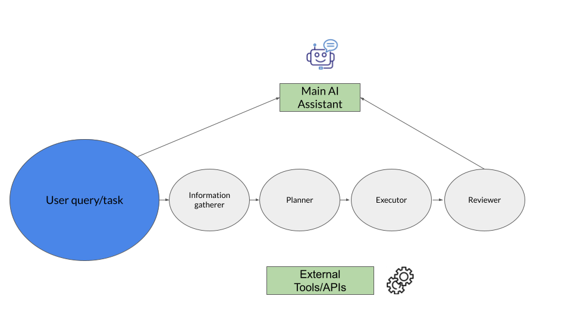

# Building an AI Planner

 
 


# 1. Overview
The development of sophisticated AI assistants capable of complex planning tasks, such as trip itinerary generation or meeting scheduling under constraints, represents a significant advancement in intelligent systems. However, deploying such capabilities on resource-constrained edge devices like mobile phones presents substantial challenges, primarily related to model size, computational efficiency, and the need for robust constraint satisfaction. Current large language models (LLMs) exhibit impressive reasoning and language understanding but often falter in multi-step planning, constraint adherence, and maintaining logical consistency, particularly in complex scenarios. Furthermore, their large size (often \>70B parameters) makes them unsuitable for edge deployment.

This report outlines a strategic approach for developing specialized AI planner model(s) for an AI assistant, specifically targeting deployment on edge devices. The core requirements are:

* The model(s) must be 8 billion parameters or smaller.  
* They must handle complex planning tasks with diverse constraints (e.g., budget, time, preferences, availability).  
* Performance should strive to be comparable to larger models while operating efficiently on edge hardware.  
* Seamless integration within the broader AI assistant architecture is essential.
  


# **2\. Proposed AI Planner Model Architecture**Strategy/Design

To achieve these goals, this strategy proposes a multi-model approach leveraging multiple specialized, smaller LLMs optimized for edge deployment using frameworks like MLC LLM. It details the model architecture, data generation and training methodologies, evaluation framework, optimization techniques, and integration patterns necessary for successful development and deployment. 

I propose a multi-model architecture using specialized LLMs, each under 8B parameters, to handle distinct types of planning and scheduling. The individual models will follow the distinctions made in the `Natural Plan` dataset [paper](https://arxiv.org/pdf/2406.04520). A key challenge for single models, such as `gemini` is to handle all of the components of the planning task as a singular task. 

There are a few ways to go about creating smaller, more focussed models to achieve certain planning tasks.

- **A** - Create a model per domain e.g. a specialised model for `meeting planning` , another for `trip planning` and so on. But this will inflate as more domain/tasks arise.
- **B** - Try to create a set of models that are specialised in general areas relevant to planning/execution of tasks. So one model may be tasked with understanding and extracting the key problem, the constraints present, and the objective. Another model may be tasked with constructing an actual plan. And another model for executing the plan. Each of these models would then become `sub-models/agents` for a wider `orchestrator` model. See diagram below as a broad example of how these models may connect.



My plan would be to try and implement option **B**.


**Example simple prompting strategy**

```python


GATHER_INFORMATION_PROMPT = """
**Task:** Extract key travel planning details from the user's query below. Identify the following information if present:

* **Origin:** The starting city or location.
* **Destination:** The main destination city or location.
* **Number of People:** How many people are traveling.
* **Start Date:** The departure or start date of the trip.
* **End Date:** The return or end date of the trip.
* **Duration:** The length of the trip (e.g., number of days, weeks).
* **Budget:** The total budget amount and currency (if specified).
* **Preferences:** Any specific requests, interests, or constraints mentioned (e.g., "likes museums", "prefers budget hotels", "needs accessible options", "avoid flights before 9 am").

**Output Format:** Present the extracted information clearly, using key-value pairs. If a piece of information is not found in the query, explicitly state "Not specified".


**Extracted Constraints:**

Here is users query:
"""

PLANNER_PROMPT = """You are a task planning assistant. Given a task and information on constraints, create a detailed plan.

Task: {input}

Create a plan with the following format:
1. First step
2. Second step
...

Plan:"""

EXECUTOR_PROMPT = """You are a task executor. Follow the plan and execute each step using available tools:

{tools}

Plan:
{plan}

Current step: {current_step}
Previous results: {previous_results}

Use the following format:
Thought: think about the current step
Action: the action to take
Action Input: the input for the action"""

```

More complicated prompting examples are [here](./efficient_ai_planner/src/data/prompts.py)

### **2.1. Model choice**

The foundation of the planner will be a pre-trained LLM fine-tuned for planning and reasoning tasks. Given the ≤8B parameter constraint, several open-source candidates offer a strong starting point:

* **Llama 3.1/3.2/4 8B:**  Strong general reasoning, instruction following, large community support, and increasing context windows (8K-128K tokens). While versatile, they might require significant fine-tuning for specialized planning. Llama 3.3 adds multilingual support. Fine-tuning Llama 3 8B specifically for planning tasks has shown promise, suggesting its potential can be unlocked with targeted training data. Llama-4 variants are the most recent release of Mixture-of-Expert (MoE) models and have a range of sizes (Behemoth at 288 billion active parameters and 2 trillion total parameters!, Maverick with 17 billion active and 400 billion total and scout with 17 billion active and 109 billion total). So these models are likely beyond the capabilities of edge device use without considerable quantization/distillation methods.  
* **Qwen 2.5 7B:** Developed by Alibaba, Qwen models excel in conversational AI and structured output generation (like JSON), which could be beneficial for producing structured plans. They also possess strong multilingual capabilities. Distilled versions of larger reasoning models based on Qwen (e.g., DeepSeek-R1-Distill-Qwen-7B) show good reasoning performance in smaller sizes. 
* **DeepSeek Coder/Instruct 7B:** These models are specifically strong in reasoning and code generation, making them potentially well-suited for tasks requiring logical deduction and structured planning. However, they might be less conversational than Qwen or Llama. 
* **Phi-4-Mini (3.8B) / Phi-4 (14B \- Requires Pruning/Distillation):** Microsoft's Phi models are designed for high performance-to-size ratio, excelling in reasoning and coding on consumer hardware. Phi-4-Mini (3.8B) has shown strong reasoning capabilities when specifically trained using tailored recipes involving distilled Chain-of-Thought (CoT) data and preference optimization. Phi-4-reasoning (14B), while slightly over budget, demonstrates state-of-the-art reasoning for its size class on planning and algorithmic benchmarks after SFT and RL, outperforming much larger models. A distilled or pruned version could fit the 8B constraint.  
* **Microsofts BitNet b1.58 2B4T**: This is a recent model set and hardware optimized solution from microsoft which utilises `llama.cpp` framework for inference. Actually training models via frameworks like `llama.cpp` is much more involved and beyond the scope for now.

**Recommendation:** Given the emphasis on complex planning and constraint satisfaction, a Phi-4-Mini (3.8B) model specifically fine-tuned for reasoning (similar to Phi-4-Mini-Reasoning ) or a fine-tuned Llama 3.1/3.2/4 8B appears most promising for the Planner role. For the Executor role(s), models excelling in tool use and instruction following, potentially smaller ones like Phi-4-Mini or fine-tuned Qwen models, could be suitable, possibly specialized further for specific tool categories. The choice may depend on initial benchmarking results after fine-tuning on planning-specific and tool-use data. 

### **2.2. Multi-Model LLM Architecture**

I propose a setup involving multiple specialized LLMs collaborating within a Plan-and-Execute framework. This architecture leverages different models optimized for distinct sub-tasks. These models will then be `sub-agents` for the main `AI Assistant/orchestrator model` to leverage.

**Proposed Workflow:**

1. **Understanding & Planning (Planner LLM):** A fine-tuned LLM (≤8B, e.g., reasoning-focused Phi-4-Mini or Llama 3.1/3.2 8B) receives the user's request (e.g., "Plan a two-week trip to Europe on a $3000 budget, visiting Paris and Rome, prefer museums"). It performs:  
   * **Natural Language Understanding & Constraint Extraction:** Parses the request to identify the goal, entities, and constraints (budget, duration, locations, preferences).  
   * **Task Decomposition & Plan Generation:** Breaks down the complex task into a sequence of smaller, actionable steps. These steps often involve invoking specific tools or APIs (e.g., "Search flights from SFO to CDG", "Find museums in Paris", "Check calendar availability for John"). The output should be a structured plan (e.g., JSON list of steps with parameters) suitable for the Executor.  
2. **Step Execution (Executor LLM/s):** One or more fine-tuned LLMs (≤8B each, optimized for tool use, e.g., Phi-4-Mini, Qwen 7B) take individual steps from the plan generated by the Planner. For each step, the Executor:  
   * **Parses the step:** Understands the required action and parameters.  
   * **Invokes the appropriate tool/API:** Executes the action (e.g., calls a flight search API, queries a calendar, performs a web search).  
   * **Returns the result:** Provides the output of the tool execution (e.g., flight options, availability slots, search results) back to the orchestrator. It's possible to have multiple specialized Executor models, each fine-tuned for a specific category of tools.  
3. **Orchestration & Response Generation:** A controlling component (which could be the Planner LLM itself, or a simpler logic module) manages the overall flow. It feeds steps to the Executor(s), collects results, potentially updates the plan based on execution outcomes (replanning if necessary by calling the Planner again), and finally synthesizes the results into a coherent response for the user.

**Advantages:**

* **Modularity:** Allows for independent development, testing, and optimization of specialized models.  
* **Specialization:** Each model can be fine-tuned and optimized for its specific role (reasoning/planning vs. tool execution), potentially leading to better performance on each sub-task.  
* **Efficiency:** Smaller, specialized models can be more resource-efficient for edge deployment compared to a single, larger generalist model. Different models could potentially use different quantization levels based on task complexity.  
* **Flexibility:** Avoids the potential brittleness of having a single monolithic model to complete all possible tasks.

**Challenges:**

* **Orchestration:** Managing the interaction and data flow between multiple models adds complexity.  
* **Consistency:** Ensuring consistent reasoning and state management across different models can be difficult.  
* **Error Propagation:** Errors in one model (e.g., the Planner generating a flawed step) can negatively impact subsequent steps by the Executor(s). Robust error handling and replanning are crucial.
* **Constraint Handling:** Relies entirely on the LLMs' ability to understand and adhere to constraints during planning and execution, which can still be a challenge for LLMs, especially complex numerical or logical constraints.

This multi-model architecture aims to balance capability and efficiency for edge deployment by distributing the workload among specialized, smaller LLMs.

## 3. Training Plan

### Dataset

#### Existing Datasets
High-quality training data is paramount for developing a capable planner LLM, especially smaller models which require carefully designed data to develop robust reasoning capabilities. We propose a strategy combining existing benchmarks with targeted synthetic data generation.

### **3.1. Leveraging Existing Datasets**

While specialized planning datasets for LLMs are emerging, we can leverage existing resources:

* **NATURAL PLAN Benchmark:** This benchmark provides realistic planning tasks (Trip Planning, Meeting Planning, Calendar Scheduling) with natural language descriptions and constraints, grounded in real-world tool outputs (Google Flights/Maps/Calendar). It includes golden plans in a specific natural language format and evaluation scripts. This dataset is ideal for both fine-tuning (using examples as training data) and evaluation.  **However**, I would argue this is best suited to evaluation only, as the data available is really just the initial input and a final output. The *intermediate steps* surrounding the forming of a plan/thinking is lacking. There is also https://huggingface.co/datasets/clembench-playpen/natural-plan-meeting
* **Other Planning/Agent Datasets:** Datasets from benchmarks like TravelPlanner, API-Bank, AgentBench, WebArena, or PDDL-based planning competition domains can provide diverse planning scenarios and action sequences, although they might require reformatting into instruction-following pairs suitable for LLM training. Instruction tuning datasets e.g. collections like Awesome-instruction-tuning can provide general instruction-following capabilities but lack specific complex planning structures.


### **3.2. Synthetic Data Generation**

Given the scarcity of large-scale, high-quality, constrained planning datasets suitable for LLMs, synthetic data generation is crucial. Synthetic data allows us to control diversity, complexity, and the types of constraints covered.

**Proposed Pipeline:**

1. **Seed Problem Generation:**  
   * Start with seed examples from existing datasets (Natural Plan) or manually crafted scenarios covering target tasks (trip, meeting planning).  
   * Use a powerful teacher LLM (Gemini) to generate variations of these problems, introducing diverse constraints. Techniques like SynthLLM's concept extraction and recombination can enhance diversity. Focus on generating problems with varying complexity levels.  
   * Ensure constraints are realistic and potentially conflicting, requiring trade-offs. Include numerical constraints (budget, duration) and logical/temporal constraints (availability, dependencies).  
2. **Plan/Solution Generation:**  
   * For each synthetic problem, use the teacher LLM or a combination of the LLM and a symbolic solver (as per the hybrid architecture) to generate candidate plans.  
   * Generate Chain-of-Thought (CoT) reasoning steps alongside the plan, explaining how constraints were considered and decisions were made. This is vital for training reasoning capabilities, especially in smaller models. Methodologies like SWiRL generate multi-step tool use and reasoning trajectories.  
   * Generate both "good" (optimal/valid) and "bad" (suboptimal/invalid) plans to create preference pairs for DPO training. Bad plans can be generated by prompting the teacher model for suboptimal solutions or by introducing deliberate constraint violations.  
3. **Data Formatting & Filtering:**  
   * **SFT Data:** Format problems and their corresponding high-quality CoT plans into instruction-response pairs (e.g., \<s\> Problem Description CoT \+ Plan \</s\>). 
   * **DPO Data:** Format problems with pairs of preferred (good) and rejected (bad) plans (e.g., {"prompt": " Problem", "chosen": "Good Plan \</s\>", "rejected": "Bad Plan \</s\>"}).
   * **Filtering:** Apply quality filtering. Use heuristics, symbolic verifiers, or even another LLM judge to check plan validity, constraint satisfaction, and reasoning coherence. Filter out low-quality or trivial examples. Process filtering (judging intermediate steps) can be more effective than outcome filtering alone.  
4. **Dataset Augmentation:** Employ techniques like paraphrasing requests, generating alternative valid plans for the same problem, or using methods like Self-Instruct to further diversify the instruction set.

This synthetic data, combined with real examples, will form the core training corpus, specifically designed to teach the target \<8B model complex, constrained planning. The focus should be on generating diverse problems with complex constraints and high-quality, verifiable reasoning steps.


#### Example dataset generation

To showcase how one could potentially create a synthetic dataset for `meeting, calendar and trip planning` - we can either utilise or create similar datasets to `Natural Plan`, which can be seen [here](./efficient_ai_planner/src/data/data/meeting_planning.json).

##### Basic dataset generation 
Use teacher LLM, e.g. `gemini` via `vertex-ai` to generate answers for the `Natural Plan` dataset. 

I have made a script to utilise the [natural plan datasets](./efficient_ai_planner/src/data/data/) to generate new responses using `gemini` with this [script](./efficient_ai_planner/src/data/create_dataset.py)

Example usage is here:

```python
python efficient_ai_planner/src/data/create_dataset.py --dataset_source ./efficient_ai_planner/src/data/data/calendar_scheduling.json --is_local_json --output_dir ./efficient_ai_planner/src/data/data/new_predictions/ --save_eval_json_path ./efficient_ai_planner/src/data/data/output_data_eval/eval_calendar.json
```
The resulting data can be used to train smaller LLMs to output responses on par with `gemini` - however this does not necessarily capture any of the *reasoning steps* involved.

##### Enhanced dataset generation - Planning Breakdown

To try and improve the dataset - I attempted to utilise the `gold standard` responses from the `Natural Plan` dataset to provide a more `step-by-step` instruction fine-tuning dataset.
The [enhanced data generator script](./efficient_ai_planner/src/data/enhanced_create_dataset.py) tries to convert the `gold standard` responses into a more plan-based flow to training.


```python
python efficient_ai_planner/src/data/enhanced_dataset_generator.py --input_data_path ./efficient_ai_planner/src/data/data/meeting_planning.json --output_jsonl_path ./efficient_ai_planner/src/data/data/enhanced_synthetic_data/step_by_step_meeting.jsonl --use_gemini_cot=False --max_examples 5
```

See example results [here](./efficient_ai_planner/src/data/data/enhanced_synthetic_data/step_by_step_meeting.jsonl)

##### Enhanced dataset generation - Planning Cot Generation

Below is my attempt to enhance the planing/reasoning present in the training dataset by using `gemini` to provide a plan of action using a `Chain-of-Thought style prompting strategy`.

```python
python efficient_ai_planner/src/data/enhanced_dataset_generator.py --input_data_path ./efficient_ai_planner/src/data/data/meeting_planning.json --output_jsonl_path ./efficient_ai_planner/src/data/data/enhanced_synthetic_data/gemini_cot_meeting.jsonl --use_gemini_cot=True --max_examples 5
```

See example results [here](./efficient_ai_planner/src/data/data/enhanced_synthetic_data/gemini_cot_meeting.jsonl)

For further examples of prompts that could be used, see [here](./efficient_ai_planner/src/data/prompts.py).

## **4\. Training and Evaluation Strategy**

Library of choice: https://github.com/huggingface/trl

A multi-stage training process combining Supervised Fine-Tuning (SFT) and Direct Preference Optimization (DPO) is recommended for both the Planner and Executor LLMs to imbue them with robust capabilities and align them with desired behaviors like constraint adherence, efficient planning, and reliable tool use. Evaluation will be anchored by the NATURAL PLAN benchmark and supplemented with specific constraint satisfaction and tool execution metrics.

For efficient training - we can opt to use Parameter Efficient Fine-tuning (PEFT) methods [PEFT library](https://github.com/huggingface/peft) 

### **4.1. Training Methodology**

1. **Supervised Fine-Tuning (SFT):**  
   * **Goal:** Teach the base models the fundamental tasks.  
     * *Planner:* Understanding instructions, extracting constraints, generating structured plans in the desired format, performing CoT reasoning.  
     * *Executor:* Understanding plan steps, correctly formatting tool/API calls, parsing tool outputs.  
   * **Data:** Use the curated datasets (Section 3\) combining real examples  and high-quality synthetic data. Use Planner-specific data for the Planner model and Executor-specific data for the Executor model(s).  
   * **Process:** Fine-tune the selected \<8B base models using standard causal language modeling objectives on the formatted SFT data. Techniques like packing short examples can improve efficiency. SFT provides the initial capability boost for the respective domains.
2. **Direct Preference Optimization (DPO):**  
   * **Goal:** Refine the SFT models to prefer outputs that are not only valid but also optimal and aligned with desired behaviors.  
     * *Planner:* Prefer plans that are efficient, adhere strictly to complex constraints, and are more likely to lead to successful execution.  
     * *Executor:* Prefer correct tool usage, robust handling of API errors, and efficient execution.  
   * **Data:** Use preference datasets containing tuples of (prompt, chosen\_output, rejected\_output) for both Planner and Executor. chosen\_output represents a better plan/execution trace, and rejected\_output a worse one. This data can be generated synthetically (Section 3.2) or derived from feedback.  
   * **Process:** Apply DPO training to the SFT models using the respective preference datasets. DPO adjusts the model's likelihood of generating preferred responses over rejected ones. This stage is crucial for handling nuanced trade-offs, improving constraint satisfaction, and enhancing tool use reliability. Combining SFT and DPO often yields better results. Consider unified or alternating training schemes  to mitigate catastrophic forgetting.

This SFT+DPO approach, applied separately to Planner and Executor models, leverages the strengths of both methods for domain adaptation and fine-grained preference alignment.


#### Example SFT training - 4-bit quantization with Q-LoRa
An example of conducting SFT with quantization methods is provided below. This requires the `bitsandbytes` library, which is restricted to `linux and windows`.

```python
python efficient_ai_planner/src/trainer/train_planner.py --base_model_id "microsoft/Phi-3-mini-128k-instruct" \
      --dataset_path ./efficient_ai_planner/src/data/data/enhanced_synthetic_data/gemini_cot_meeting.jsonl  --output_dir ./sft_cot_planner_adapter \
      --epochs 1 \
      --batch_size 1 \
      --gradient_accumulation 8 \
      --max_seq_length 2048
```
### **4.2. Evaluation Framework**

A comprehensive evaluation framework is needed to assess the planner's performance, feasibility, and efficiency, considering both the planning and execution stages.

* **Benchmark:** The primary benchmark will be **NATURAL PLAN**. It provides realistic tasks and a defined evaluation protocol focusing on the final plan output. Other benchmarks like TravelPlanner, API-Bank, AgentBench, WebArena, Plancraft, ProcessTBench, SafeAgentBench, or custom task suites can supplement this, especially for evaluating tool execution.  
* **Core Metric (End-to-End):**  
  * **Exact Match (EM) Score:** As defined in NATURAL PLAN, measures if the final generated plan/response exactly matches the golden plan in key aspects.18 Suitable for tasks with a single optimal solution.  
  * **Task Success Rate:** For tasks with multiple valid solutions or complex goals, define a task-specific success metric (e.g., percentage of goals achieved, successful completion of a web navigation task).  
* **Supporting Metrics (Component-Level):**  
  * **Planner Evaluation:**  
    * *Plan Validity/Feasibility:* Check if the generated high-level plan is logically sound and potentially executable (e.g., steps are in a reasonable order, required information is gathered before use).  
    * *Constraint Satisfaction (Planning):* Measure if the *intended* plan adheres to all explicit constraints from the prompt.  
  * **Executor Evaluation:**  
    * *Tool Execution Accuracy:* Measure the success rate of individual tool calls (e.g., correct API syntax, successful API response). Requires instrumented tools or simulated environments.  
    * *Result Parsing Accuracy:* Check if the Executor correctly extracts relevant information from tool outputs.  
  * **Overall System:**  
    * *Constraint Satisfaction (Final):* Measure if the *final outcome* after execution satisfies all constraints.  
    * *Efficiency/Optimality:* Measure plan length, number of tool calls, latency, resource utilization.  
* **Methodology:**  
  * **Complexity Analysis:** Evaluate performance across different complexity levels within benchmarks.  
  * **Ablation Studies:** Compare the multi-model approach against single-model baselines. Evaluate the impact of SFT vs. SFT+DPO for each component.  
  * **Generalization Testing:** Evaluate on held-out tasks or other benchmarks. 
  * **Error Analysis:** Categorize failure modes (e.g., planning errors, execution errors, constraint violations) to identify weaknesses in specific components.  
  * **Robustness Testing:** Evaluate performance under paraphrased instructions or noisy inputs.

This evaluation framework provides a rigorous assessment of both the planning and execution capabilities of the multi-model system.


#### Example Evaluation of Planners
For a simple evaluation against exact metric calculation, the evaluation scripts for the `Natural Plan` dataset are provided [here](./efficient_ai_planner/src/evaluator/)

You can run these scripts given an appropriate format JSON file with model responses e.g. [calendar model outputs](./efficient_ai_planner/src/data/data/output_data_eval/eval_calendar.json).

```python
python efficient_ai_planner/src/evaluator/evaluate_calendar_scheduling.py
```

These scripts can be used to evaluate the individual tasks from `Natural Plan` - but this could be extended to include more nuanced metrics and even use an LLM-based evaluation framework to derive the quality of the response.


## **5\. Model Optimization for Edge Devices**

Deploying the multi-model planner system on edge devices necessitates aggressive optimization for each component model to meet memory, latency, and power constraints. The **MLC LLM (Machine Learning Compilation for Large Language Models)** framework is specifically designed for universal, high-performance deployment of LLMs on diverse hardware, including mobile GPUs (iOS/Android) and web browsers.

### **5.1. Quantization**

Quantization is the primary technique for reducing model size and accelerating inference. MLC LLM provides robust support for various quantization modes.46

* **Recommended Technique:** **4-bit quantization** (e.g., q4f16\_1 or q4f32\_1) offers a strong balance between compression and performance retention. It can reduce model size significantly (potentially \~75% compared to FP16) making models like Llama 3 8B or Phi-4 feasible for mobile deployment. MLC LLM uses grouping quantization by default.
* **Supported Modes in MLC LLM:**  
  * Weight-Only: q4f16\_1, q4f32\_1 (4-bit weights, FP16/FP32 activations), q3f16\_1, q0f16/q0f32 (no weight quantization, FP16/FP32 activations), q4f16\_awq.  
  * Weight-Activation (CUDA only): e4m3\_e4m3\_f16, e5m2\_e5m2\_f16 (FP8 quantization).  
* **Process:** MLC LLM provides tools (mlc\_llm convert\_weight) to apply these quantization modes during the weight conversion process. The mlc-chat-config.json file specifies the desired quantization mode.  
* **Multi-Model Consideration:** Different quantization levels could be applied to the Planner and Executor models based on their complexity and resource requirements. For instance, the Executor(s) might tolerate more aggressive quantization if their tasks are simpler.

### **5.2. Other Potential Optimizations (Consideration)**

While quantization is the main focus for MLC LLM edge deployment, other techniques could be explored:

* **Pruning:** Removing redundant weights or structures. While not a core advertised feature of MLC LLM, pruning techniques exist for LLMs.  
* **Knowledge Distillation:** Training the smaller target models (\<8B) to mimic larger teacher models. The synthetic data generation process (Section 3.2) already incorporates elements of this.  
* **Architectural Choices:** Selecting base models known for efficiency (e.g., Phi family) contributes significantly.


#### Example inference

An example of loading in a trained LLM for efficient inference is provided, see [inference script](./efficient_ai_planner/src/inference/load_model.py).

Recommended libraries for model serving:
- Ollama - very easy to setup and due to popularity, well maintained and great for both open and closed-source models (https://github.com/ollama/ollama). This is quite focussed on local deployment, as opposed to enterprise scale deployments
- vLLM - similar to `ollama` but perhaps a little better suited to parallel processing and GPU serving (https://github.com/vllm-project/vllm)

### **5.3. MLC LLM Toolchain for Deployment**

MLC LLM provides an end-to-end workflow for preparing and deploying models on edge devices:

1. **Model Conversion & Quantization:** Convert the fine-tuned Planner and Executor model weights into MLC format and apply chosen quantization modes using mlc\_llm convert\_weight.44 Generate respective mlc-chat-config.json files using mlc\_llm gen\_config. 
2. **Model Compilation:** Compile each model architecture for the specific target platform (e.g., Android, iOS, WebGPU) using mlc\_llm compile.44 This generates optimized model libraries (.so, .dylib, .wasm, .tar). MLC LLM leverages Apache TVM for backend-specific optimizations.
3. **Packaging:** Use mlc\_llm package to bundle the compiled model libraries and quantized weights for each model into a distributable format.44 This command reads a mlc-package-config.json file specifying targets and models. 
4. **Inference:** Utilize the MLC LLM runtime engine (MLCEngine) via its native APIs within the AI assistant application to load the packaged models and perform inference. The application will need logic to manage loading/unloading multiple models based on the workflow stage, considering device memory constraints.

MLC LLM's compilation focus makes it suitable for deploying the multi-model planner system on mobile devices.

## **6\. Integration Strategy within AI Assistant**

Seamlessly integrating the specialized multi-model planner into the broader AI assistant architecture is crucial. A modular design using a Plan-and-Execute pattern, potentially managed by a framework like LangGraph, is recommended.

### **6.1. Agent Architecture: Plan-and-Execute with Multiple LLMs**

The Plan-and-Execute architecture remains suitable, but adapted for multiple specialized LLMs:

1. 1. **Information and Constraint Gather Agent:** This component utilizes a fine-tuned **Constraints LLM** (≤8B). It receives the user request, with natural language descriptions of constraints etc. The role of this model is to output a more LLM friendly stuctured set of information to be used by the **Planner Model**
2. **Planner Agent:** This component utilizes the fine-tuned **Planner LLM** (≤8B). It receives the user request, context, and constraints. Its role is to decompose the task and generate a structured, high-level plan consisting of steps (often tool calls).  
3. **Executor Agent(s):** This component utilizes the fine-tuned **Executor LLM(s)** (≤8B each). It takes individual steps from the plan and executes them by invoking tools/APIs. It returns results and status updates. There might be one general Executor or multiple specialized Executors managed by an orchestrator.


#### Example Agentic Workflow

##### Langchain - Travel planner
A premade example for using `Langchain` and a `ReAct Agent` approach is provided [here](./efficient_ai_planner/src/agentic_ai_assistant/example_agents.py). 
This was tailored for `travel planning` but showcases a decent workflow for breaking down planning into multiple steps and interactions.

##### Google ADK 
An example `agentic workflow` setup for this `AI Assistant` is provided [here](./google_adk_planner/)..

Using `Googles` new `Agent Development Kit (ADK)` - it is relatively easy to build an agentic AI assistant with any model.

This can be run via the following command:

```
adk run google_adk_planner
```

For command line interaction or:
```
adk web
```

I have not provided a working solution nor iterated/improved it, but just to showcase how you can combine models into an `agent framework`.

But the logic/orchestration of models can be achieved with native python or any popular `agent framework` e.g. (Langchain, Llama-index etc). 


## **7\. Conclusion and Future Directions**

### **7.1. Summary of Proposed Strategy**

This report outlines a strategy for developing AI planner capabilities (using models ≤8B parameters each) suitable for edge deployment within an AI assistant. The core recommendation is a **multi-model LLM architecture** following a **Plan-and-Execute** pattern. This involves:

* A **Planner LLM:** Fine-tuned for reasoning, constraint understanding, and task decomposition (e.g., based on Phi-4-Mini or Llama 3.1/3.2 8B). It generates a structured plan of steps (often tool calls).  
* One or more **Executor LLM(s):** Fine-tuned for reliable tool/API execution based on the Planner's steps (e.g., based on Phi-4-Mini, Qwen 7B, potentially specialized).

Training involves a multi-stage **SFT+DPO** approach for each specialized model, using a combination of real and targeted synthetic planning and execution data. Evaluation leverages the **NATURAL PLAN benchmark** and metrics assessing plan validity, constraint satisfaction, and execution success.

Edge deployment relies on the **MLC LLM framework** , utilizing **4-bit quantization**  and MLC's tools to optimize and package the multiple models for mobile platforms. Integration requires careful orchestration, clear API design, robust state management, and effective error handling/replanning mechanisms involving feedback to the Planner LLM.

### **7.2. Feasibility and Trade-offs**

This multi-model strategy offers a feasible path for edge deployment within the 8B parameter limit per model. Using multiple smaller, specialized models optimized via MLC LLM makes edge deployment viable. It leverages the strengths of LLMs in understanding and generation while distributing the cognitive load.

However, trade-offs compared to a single model or the previously discussed hybrid approach exist:

* **Orchestration Complexity:** Managing multiple models, their states, and communication introduces significant engineering overhead.  
* **Reliance on LLM Reasoning:** The entire planning and constraint satisfaction process relies on the LLMs' reasoning capabilities, which can still be inconsistent or prone to hallucination, especially with complex constraints, without the guarantees of a symbolic layer.  
* **Error Propagation:** Errors made by the Planner are likely to be propagated to the Executor, and execution failures require robust replanning loops involving the Planner.  
* **Resource Management:** Running multiple models (even if small) on an edge device requires careful memory management (loading/unloading models) which can impact latency.

The choice of this architecture prioritizes leveraging LLM flexibility and avoids symbolic formalisms, but requires careful engineering for orchestration, error handling, and resource management on the edge.

### **7.3. Future Directions**

Building upon this multi-model strategy, future work could focus on:

* **Advanced Synthetic Data:** Develop more sophisticated synthetic data covering complex tool interactions, error recovery scenarios, and intricate constraint combinations specifically for training Planner and Executor models.  
* **Refined Training Techniques:** Explore unified or alternating fine-tuning approaches for SFT and DPO across the multiple models. Investigate RL techniques tailored for multi-step, multi-agent tool use and planning.
* **Improved Orchestration & Communication:** Research more efficient and robust methods for coordinating the Planner and Executor models, potentially using frameworks like LangGraph or developing custom solutions.  For travel planning specifically, this would be a good starting point: https://osu-nlp-group.github.io/TravelPlanner/ 
* **Enhanced Replanning/Error Recovery:** Develop more sophisticated strategies for the Planner to diagnose execution failures reported by the Executor and generate effective recovery plans.
* **Constraint Verification:** Explore lightweight methods for the system to verify constraint satisfaction during or after execution, potentially using a dedicated small verification model or rule-based checks triggered by the orchestrator.  
* **Personalization and Continual Learning:** Implement mechanisms for the Planner and potentially Executors to adapt based on user feedback and interaction history.

By pursuing this multi-model strategy, focusing on specialized model training, robust orchestration, and edge optimization, it is possible to develop an effective AI planner system for the AI assistant on mobile devices.


#### **References**

1. mlc-ai/mlc-llm: Universal LLM Deployment Engine with ML Compilation \- GitHub, accessed on May 2, 2025, [https://github.com/mlc-ai/mlc-llm](https://github.com/mlc-ai/mlc-llm)
2. Phi-4-Mini Technical Report: Compact yet Powerful Multimodal Language Models via Mixture-of-LoRAs \- arXiv, accessed on May 2, 2025, [https://arxiv.org/html/2503.01743v2](https://arxiv.org/html/2503.01743v2)  

3.  \[2406.04520\] NATURAL PLAN: Benchmarking LLMs on Natural Language Planning \- arXiv, accessed on May 2, 2025, [https://arxiv.org/abs/2406.04520](https://arxiv.org/abs/2406.04520)  
4.  google-deepmind/natural-plan \- GitHub, accessed on May 2, 2025, [https://github.com/google-deepmind/natural-plan](https://github.com/google-deepmind/natural-plan)  

5.  Planet: A Collection of Benchmarks for Evaluating LLMs' Planning Capabilities \- arXiv, accessed on May 2, 2025, [https://arxiv.org/html/2504.14773v1](https://arxiv.org/html/2504.14773v1)  
6.  Plan-and-Act: Improving Planning of Agents for Long-Horizon Tasks \- arXiv, accessed on May 4, 2025, [https://arxiv.org/html/2503.09572v2](https://arxiv.org/html/2503.09572v2)
7.  A curated list of awesome instruction tuning datasets, models, papers and repositories. \- GitHub, accessed on May 2, 2025, [https://github.com/zhilizju/Awesome-instruction-tuning](https://github.com/zhilizju/Awesome-instruction-tuning)  
8.  Zjh-819/LLMDataHub: A quick guide (especially) for trending instruction finetuning datasets \- GitHub, accessed on May 2, 2025, [https://github.com/Zjh-819/LLMDataHub](https://github.com/Zjh-819/LLMDataHub)  
9.  \[2503.14023\] Synthetic Data Generation Using Large Language Models: Advances in Text and Code \- arXiv, accessed on May 4, 2025, [https://arxiv.org/abs/2503.14023](https://arxiv.org/abs/2503.14023)
10. Large Language Model Performance Benchmarking on Mobile Platforms: A Thorough Evaluation \- arXiv, accessed on May 2, 2025, [https://arxiv.org/html/2410.03613v1](https://arxiv.org/html/2410.03613v1)
11. Travel Planner (https://osu-nlp-group.github.io/TravelPlanner/)  

12. Plan-and-Execute Agents \- LangChain Blog, accessed on May 2, 2025, [https://blog.langchain.dev/planning-agents/](https://blog.langchain.dev/planning-agents/)  
13. ReAct vs Plan-and-Execute: A Practical Comparison of LLM Agent Patterns, accessed on May 2, 2025, [https://dev.to/jamesli/react-vs-plan-and-execute-a-practical-comparison-of-llm-agent-patterns-4gh9](https://dev.to/jamesli/react-vs-plan-and-execute-a-practical-comparison-of-llm-agent-patterns-4gh9)
14. Unlocking the Planning Capabilities of Large Language Models with Maximum Diversity Fine-tuning \- arXiv, accessed on May 2, 2025, [https://arxiv.org/html/2406.10479v2](https://arxiv.org/html/2406.10479v2)   
15. LightPlanner: Unleashing the Reasoning Capabilities of Lightweight Large Language Models in Task Planning \- arXiv, accessed on May 4, 2025, [https://arxiv.org/html/2503.08508v1](https://arxiv.org/html/2503.08508v1)  
16. Plan-and-Act: Improving Planning of Agents for Long-Horizon Tasks \- arXiv, accessed on May 4, 2025, [https://arxiv.org/html/2503.09572v3](https://arxiv.org/html/2503.09572v3)  
17. A Comprehensive Survey of Small Language Models in the Era of Large Language Models: Techniques, Enhancements, Applications, Collaboration with LLMs, and Trustworthiness \- arXiv, accessed on May 2, 2025, [https://arxiv.org/html/2411.03350v1](https://arxiv.org/html/2411.03350v1)  
 
18. raunak-agarwal/instruction-datasets: All available datasets for Instruction Tuning of Large Language Models \- GitHub, accessed on May 2, 2025, [https://github.com/raunak-agarwal/instruction-datasets](https://github.com/raunak-agarwal/instruction-datasets)  
19. \[2412.21033\] Plancraft: an evaluation dataset for planning with LLM agents \- arXiv, accessed on May 2, 2025, [https://arxiv.org/abs/2412.21033](https://arxiv.org/abs/2412.21033)  
20. Systematic Analysis of LLM Contributions to Planning: Solver, Verifier, Heuristic \- arXiv, accessed on May 2, 2025, [https://arxiv.org/html/2412.09666v1](https://arxiv.org/html/2412.09666v1) 
21. Solving General Natural-Language-Description Optimization Problems with Large Language Models \- arXiv, accessed on May 2, 2025, [https://arxiv.org/html/2407.07924v1](https://arxiv.org/html/2407.07924v1)  

22. Scaling Laws of Synthetic Data for Language Models \- arXiv, accessed on May 2, 2025, [https://arxiv.org/html/2503.19551v2](https://arxiv.org/html/2503.19551v2)  

23. Balancing Cost and Effectiveness of Synthetic Data Generation Strategies for LLMs \- arXiv, accessed on May 2, 2025, [https://arxiv.org/html/2409.19759v3](https://arxiv.org/html/2409.19759v3)  
24. A Survey on Post-training of Large Language Models \- arXiv, accessed on May 4, 2025, [https://arxiv.org/html/2503.06072v1](https://arxiv.org/html/2503.06072v1)  

25. Revolutionizing Mobile Interaction: Enabling a 3 Billion Parameter GPT LLM on Mobile, accessed on May 2, 2025, [https://arxiv.org/html/2310.01434](https://arxiv.org/html/2310.01434)  

26. Welcome to MLC LLM — mlc-llm 0.1.0 documentation, accessed on May 2, 2025, [https://llm.mlc.ai/docs/](https://llm.mlc.ai/docs/)  
27.  LLM agents \- Agent Development Kit \- Google, accessed on May 2, 2025, [https://google.github.io/adk-docs/agents/llm-agents/](https://google.github.io/adk-docs/agents/llm-agents/)  
